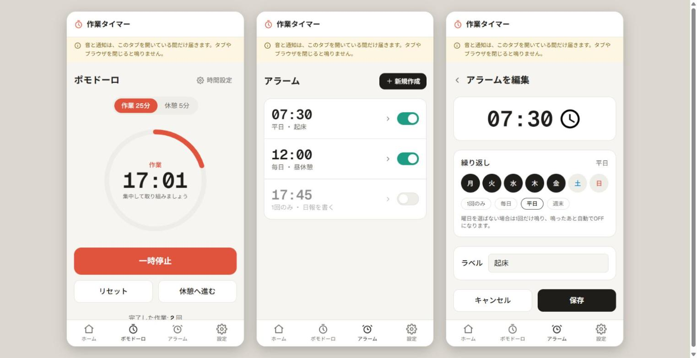
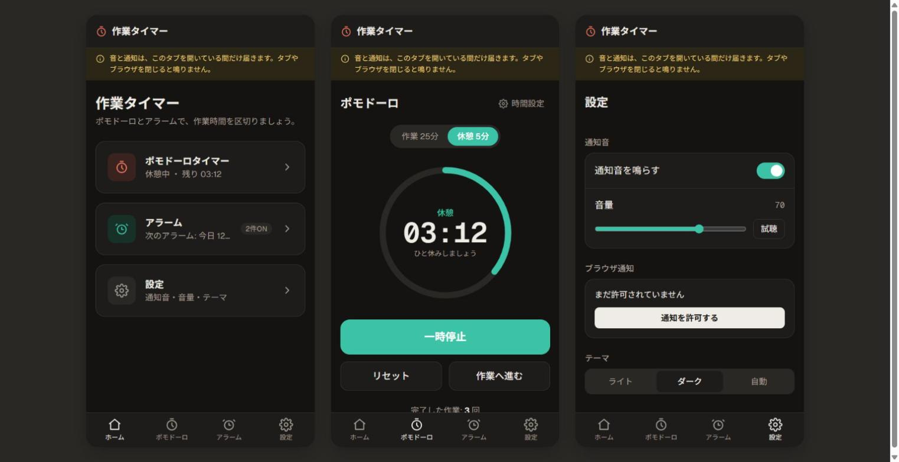

# 作業タイマー

ポモドーロタイマーとアラームで、作業時間に区切りをつけるための Web アプリです。
PC・スマホのブラウザから、インストールもログインもせずに使えます。

**公開URL**: https://timer-app-alpha-ten.vercel.app

## スクリーンショット

ライト表示（ポモドーロ／アラーム一覧／アラームの編集）



ダーク表示（ホーム／休憩中のポモドーロ／設定）



## 主な機能

- **ポモドーロタイマー**
  - 作業時間と休憩時間を分単位で設定できる
  - スタート・一時停止・リセット・スキップができる
  - 作業と休憩は自動で切り替わり、切り替わるときに音とブラウザ通知で知らせる
- **アラーム**
  - 複数のアラームを登録・編集・削除し、それぞれ ON/OFF を切り替えられる
  - 曜日を指定して繰り返せる。曜日を選ばなければ1回だけ鳴り、鳴ったあと自動で OFF になる
- **設定**
  - 通知音の ON/OFF と音量、テーマ（ライト／ダーク／自動）を変えられる
  - テスト通知を送って、通知が届くか確認できる
- **データの保存**
  - 設定やアラームはブラウザ（localStorage）に保存され、次に開いたときも残る
  - ページを移動しても、再読み込みしても、タイマーは続きから動く

> 音と通知は、アプリのタブを開いている間だけ届きます。タブやブラウザを閉じると鳴りません。

## 技術スタック

| 分類 | 使用技術 |
|---|---|
| フレームワーク | Next.js 16（App Router） |
| UI | React 19 |
| 言語 | TypeScript 5 |
| スタイル | Tailwind CSS v4 |
| データ保存 | localStorage（サーバー・データベースなし） |
| 通知・音 | Web Notification API、Web Audio API |
| テスト | Vitest |
| ホスティング | Vercel |

## 開発環境で動かす

```bash
npm install
npm run dev      # http://localhost:3000 で起動
npm test         # テストを実行
npm run lint     # ESLint
npm run build    # 本番用にビルド
```

## ドキュメント

- [要件定義書](要件定義書.md) — 背景・目的、ユーザーストーリー、機能要件など
- [CLAUDE.md](CLAUDE.md) — Claude Code 向けの設計の説明と、このプロジェクトのルール
